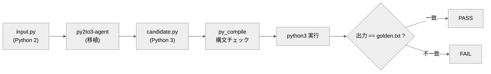

# py2to3-agent

サポートの終わった **Python 2 のコードを、振る舞いを保ったまま Python 3 へ移植する**エージェントと、その移植が正しいかを自動で判定する**オラクル（採点プログラム）**。

## これは何？

このリポジトリは、移植が正しいかを**機械が判定するしくみ（テストオラクル）**を中心に置き、「先に合格条件を決めてから作る」**評価駆動開発（EDD）**の実例を示します。

判定方式は **決定的オラクル（golden 比較）**：移植後のコードを Python 3 で実行し、出力が「正解の出力（golden）」と一致するかで合否を出します。Python 2 はもう動かせないことが多いので、**期待される出力をあらかじめ保存（golden）して比較**します。客観的で再現可能です（判定は corpus に用意した入力での出力一致で、あらゆる入力での等価を保証するものではありません）。

## クイックスタート

必要なもの：Python 3 のみ（追加インストール不要）。**コマンドはリポジトリのルートで実行**します。

**(1) 同梱の正しい移植（reference）を採点** — エージェントを動かさなくても確認できます：

```bash
python eval/oracle.py
```

→ 各ケースが PASS の表が出て、終了コード 0。

**(2) オラクル自身の健全性チェック**：

```bash
python eval/oracle.py --selftest
```

→ 途中の「②壊れた移植」では **FAIL が出るのが正常**。最後に次が出れば成功：

```
## オラクル判定: PASS（信頼できる外部オラクル）
```

## エージェントの動かし方（candidate の作り方）

`agent/py2to3-agent.md` は **Claude Code 用のエージェント定義（指示書）** です。呼ばれて初めて動きます。

- `input.py` を `candidate.py` に移植させるには、この定義を **`.claude/agents/` に置いて呼ぶ**か、定義の指示に従って**任意の LLM に移植させ**ます。
- 完全自動の1コマンドは用意していません（学習・手法実証が目的）。
- `candidate.py` が無くても、クイックスタート (1) の **reference** で全工程を再現できます。

エージェント出力を採点するとき：

```bash
python eval/oracle.py --candidate candidate
```

## しくみ（どう合否を出すか）



1. `eval/corpus/<ケース>/input.py` … 移植のお題（Python 2）。
2. エージェントが `candidate.py`（Python 3）へ移植。
3. `eval/oracle.py` が **`py_compile` で構文チェック → `python3` で実行 → 出力が `golden.txt` と完全一致するか**で判定。

## 合否の基準（eval）

各ケースで「`py_compile` 成功 ＋ `python3` 実行の標準出力が `golden.txt` と完全一致」。

## ファイル構成

- `agent/py2to3-agent.md` … エージェントの定義。
- `eval/oracle.py` … 採点プログラム（決定的オラクル。`--selftest` 内蔵）。
- `eval/corpus/<ケース>/` … `input.py`（お題）/ `golden.txt`（期待出力）/ `reference.py`（正しい移植の見本）。
- `candidate.py` … エージェントが生成する採点対象（`.gitignore` 対象。clone 直後は存在しません）。
- `design/design.md` … 設計の考え方。

---

自作 AI エージェント集（評価駆動開発の実証）の一つ。手法の背景は [design/design.md](design/design.md) を参照。
